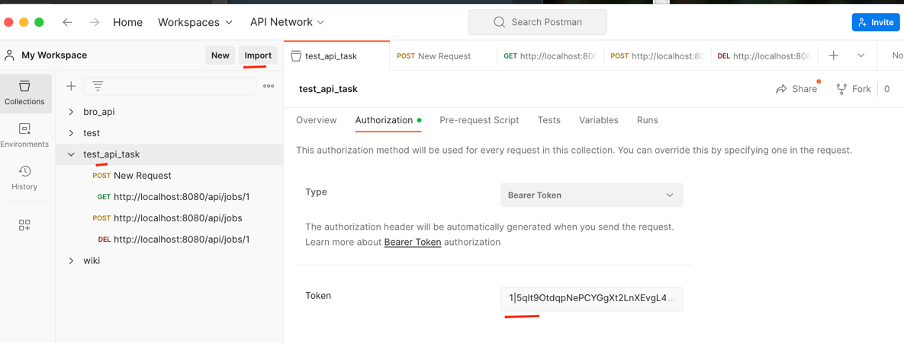

## Installation

First, you need to clone the project 

```cd test_rest_api```

and run all the docker containers
```docker-compose up -d```.

Install all the dependencies
```docker compose run php composer install```

The `.env.dist` file contains additional customization that should be moved to the `.env` file

The site will then be accessible at the following url:
http://localhost:8080/


### Import database 

You can run the following command to load the base into the Container:

```cat backup.sql | docker exec -i laravel_mysql /usr/bin/mysql -u root --password=root laravel```


### Api testing 

For testing it is best to use postman, I created a ready-made import file with all requests and authentication token, file ```test_api_task.postman_collection.json```



### Command testing 
Just run ```docker compose run php php artisan app:scrape-and-store-command```